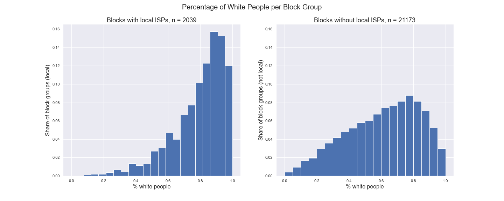

### Quick Note
This is a summary of a presentation given for the [Graduates Rising in Information and Data Science (GRIDS)](https://gridsusc.github.io/) student organization at the University of Southern California. This presentation was given on April 21, 2021 and received the "Best Presentation" award out of about 20 presentations.

The team included Jonathan Gonzalez and Asjad Asif Jah, and the mentor for the project was Dr. Hernan Galperin.

# Introduction

The pandemic has highlighted the need of affordable internet access for all. Broadband is more than just broadband. A strong and affordable internet connection provides access to career and education opportunities, basic healthcare, banking systems, and much more. 

Conventional wisdom tells that the best way to increase broadband access is by using public funds to invest in traditional, large, and sometimes monopolistic internet service providers (think AT&T or Comcast). This is due to the benefits of economies of scale, meaning that larger businesses are typically more efficient and can provide a cheaper or higher quality service than a smaller business can. 

The goal of this project was to detect how the presence of a locally-owned, smaller ISP called a microtelco can potentially increase competition, yield better speeds, and provide other downstream benefits for a community.

# Data Sources and Methods

We used geographic and demographic data from the US Census Bureau, ISP data from the California Public Utilities Commission, and internet speed data from Ookla.

Each data set came in various shapes/sizes/forms. The data is highly geographically dependent, so GIS analysis was performed in parallel to traditional statistical analysis.

We joined this data together to create an interactive, AWS-hosted map that shows the presence of local ISPs and the quality of internet throughout California. The map shows data at a census block group level, and the data has been aggregated using the census block population. The figure below provides a snapshot for how the looks. A more detailed interactive map is in the works, the map we created is more of a proof of concept.

# Microtelcos Overview

In California, there are 78 local ISPs. The local ISPs have a max market reach of about 2%. 

The figure below shows the distribution of block groups as a function of the percentage of white people per block group. The graph on the left is block groups with local ISPs, and the graph on the right is block groups without local ISPs. 

  

The figure below shows the distribution of block groups as a function of the urban index of the block group. A low urban index means the block group is very rural, while a high urban index means the block group is very urban. Again, the graph on the left represents block groups with local ISPs, and the graph on the right represents block groups without local ISPs. The block groups with local ISPs tend to be more underserved.

Additional histograms can be found in [the figures folder for this repository.](figures/histograms/) 

# Matching Census Block Groups

To find the effects that a local ISP has on a block group’s internet performance, we used a common social science technique called matching. Matching is similar to k-means clustering, where k approaches the number of treated units. We purposefully reduce the dimensionality when matching to include only what we think are the most relevant dimensions. We do this to increase matching quality and processing speed. 

The figure below illustrates what matching looks like. The figure shows histograms of one of our matching variables which is the percentage of people with a Bachelor’s degree or higher for a block group. Before, matching, we can see that block groups with a local ISP tend to have less education than those without a local ISP (by virtue of being more rural). In matching, the goal is to find similar block groups to our treated block groups so we can find the effect of the treatment. After matching, we can see that we have two groups with similar characteristics. Note that this is done along multiple variables.

# Results

The figures below show prelimenary results. We find that the presence of a local ISP in rural areas increases in ISP coverage by 5%, has little improvement in overall internet coverage (which includes mobile broadband coverage), and unfortunately has an overall decrease in internet speed.

## Note on Internet Speed Difference

Since we are seeing an increase in coverage in rural areas, one potential explanation is that local ISPs provide a service that is cheaper or more accessible to certain communities, even though that service may have slower speeds.

As of now, we cannot confirm that local ISPs have lower costs compared to traditional ISPs since data about internet costs are very limited.

# Thank you for Reading!

           

